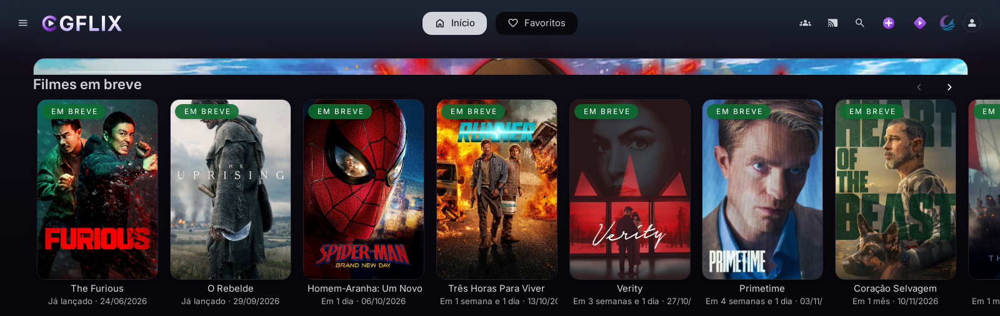

# CGFLIX theme for Jellyfin

Purple and OLED-black look for Jellyfin, built as a layer on top of [ElegantFin](https://github.com/lscambo13/ElegantFin),
plus a few things we needed on our own server: a theme that loads with **no flash** of the stock UI, the
**Home Screen Sections "Upcoming" calendar in Brazilian Portuguese**, and a **faster, rebranded Moonfin Web**.



| Piece | What it does |
|---|---|
| `cgflix.css` | Palette (purple accents on OLED black), card focus glow (TV remotes too), login over the server's poster mosaic, purple spinners, StreamLimiter dialog. Imports ElegantFin + its Media Bar add-on. |
| `addons/hss-upcoming-ptbr.css` / `.js` | Home Screen Sections calendar in pt-BR: "Em breve" badge, "Hoje", "Amanhã", "Em 9 dias", "Em 3 semanas e 2 dias", "Já lançado" (the plugin says "Today!" even for past dates and counts days in UTC), "Episódio 43", "A definir". |
| `nginx/jellyfin-inject.conf.example` | Injects the theme into `index.html` so nobody sees the stock logo, blue spinner or default login first. |
| `nginx/moonfin-web.conf.example` + `tools/moonfin-sync.sh` | Moonfin Web from nginx, pre-compressed: `main.dart.wasm` 20.4 MB → 6.7 MB on our server; clean `index.html`; rebranded loading screen. |
| `assets/` | The CGFLIX logo (an example: use your own brand). |

## Install

**Quick (CSS only):** Dashboard → General → Branding → Custom CSS:

```css
@import url("https://cdn.jsdelivr.net/gh/CaioGuerras/cgflix-jellyfin-theme@main/cgflix.css");
/* optional, pt-BR "Em breve" badge for Home Screen Sections */
@import url("https://cdn.jsdelivr.net/gh/CaioGuerras/cgflix-jellyfin-theme@main/addons/hss-upcoming-ptbr.css");
```

Change the login text with `:root { --loginPageText: "Your text"; }`.

**No flash (recommended if Jellyfin is behind nginx):** copy the files to your nginx box and follow
`nginx/jellyfin-inject.conf.example`. The calendar translation (`.js`) needs this route (or any JavaScript injector),
because Custom CSS can't run scripts.

**Moonfin Web:** see `nginx/moonfin-web.conf.example`; rerun `tools/moonfin-sync.sh` after each Moonbase update.

## Moonfin tips we learned the hard way

- **Skip the first-run layout wizard for everybody:** Moonfin asks for layout when four preferences are missing:
  `navbarPosition`, `mediaBarMode`, `homeRowsStyle` and `detailScreenStyle`. Moonbase's *Default User Settings* does not keep
  these fields, but the per-user settings file does (`plugins/configurations/Moonfin/<userId>.json`, key `global`). We write
  `top` / `gallery` / `v2` / `minimalist` there for each user.
- **Seerr single sign-on inside Moonfin uses Jellyfin Quick Connect.** If Quick Connect is disabled on the server, Moonfin
  shows "Sign in to Seerr" forever. Enable it (you can still hide the button on the web login with
  `.btnQuick { display: none !important; }`).
- **Upcoming calendars in Moonfin** read Sonarr/Radarr through a Seerr **admin** session kept by Moonbase: until an admin signs
  in to Seerr from Moonfin once, they return HTTP 503.
- If your `mime.types` lacks `.mjs` and you send `X-Content-Type-Options: nosniff`, Moonfin Web hangs on the loading screen.

## Credits and license

- [ElegantFin](https://github.com/lscambo13/ElegantFin) by lscambo13 (GPL-2.0): the base theme and its Media Bar add-on, imported as-is.
- Made for CGFLIX, a family-and-friends Jellyfin server in Brazil.
- License: **GPL-2.0-or-later** (see `LICENSE`), same family as ElegantFin.

---

## Em português

Tema roxo e preto OLED para o Jellyfin, uma camada sobre o ElegantFin, com abertura sem piscar (injeção pelo nginx),
calendário do Home Screen Sections em português ("Em breve", "Hoje", "Amanhã", "Em 9 dias", "Já lançado", "Episódio 43")
e o Moonfin Web mais leve (wasm de 20,4 MB → 6,7 MB) e com a sua marca. Instalação rápida: cole o `@import` acima em
Painel → Geral → Branding → CSS personalizado. Para não piscar e para traduzir o calendário, use os exemplos da pasta `nginx/`.
